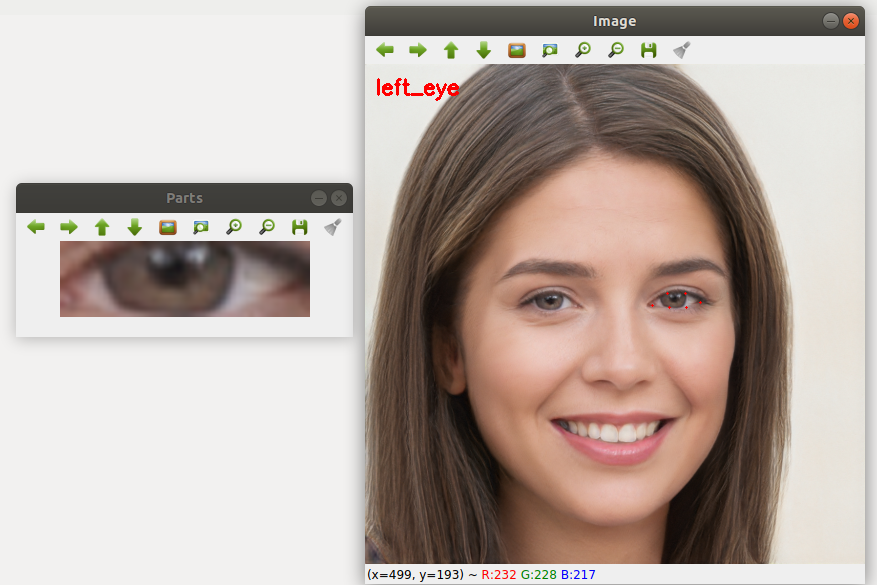
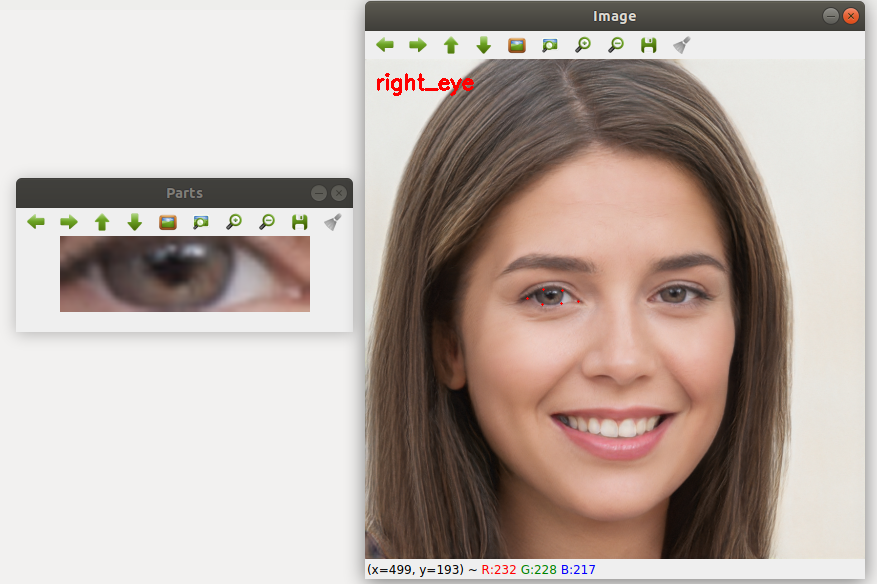
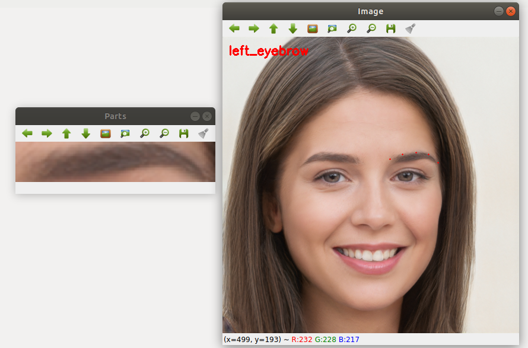
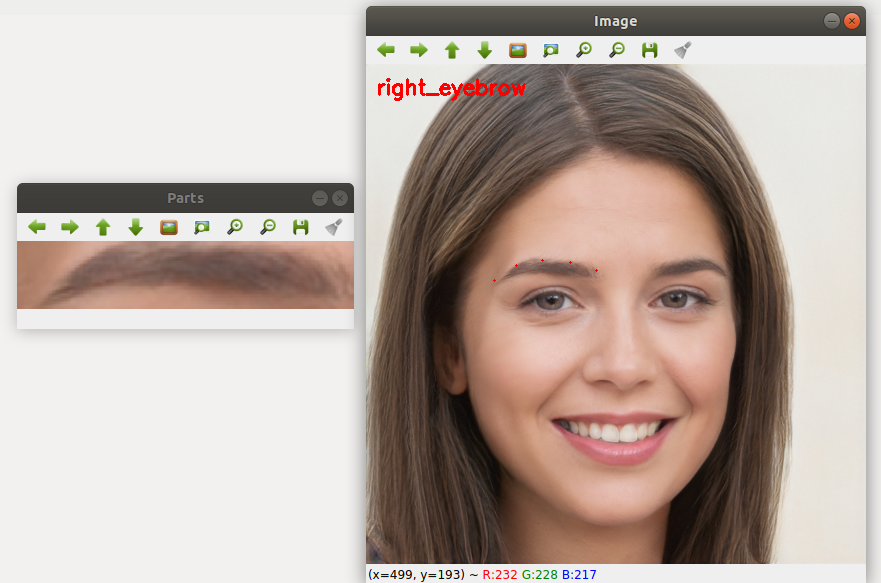
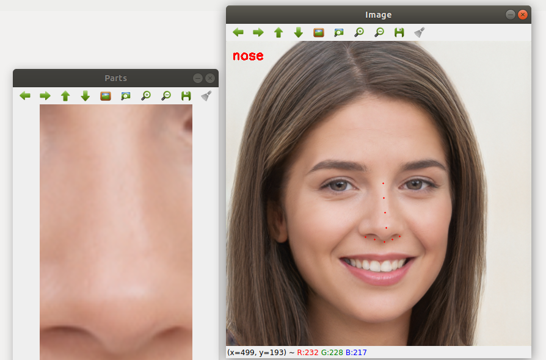
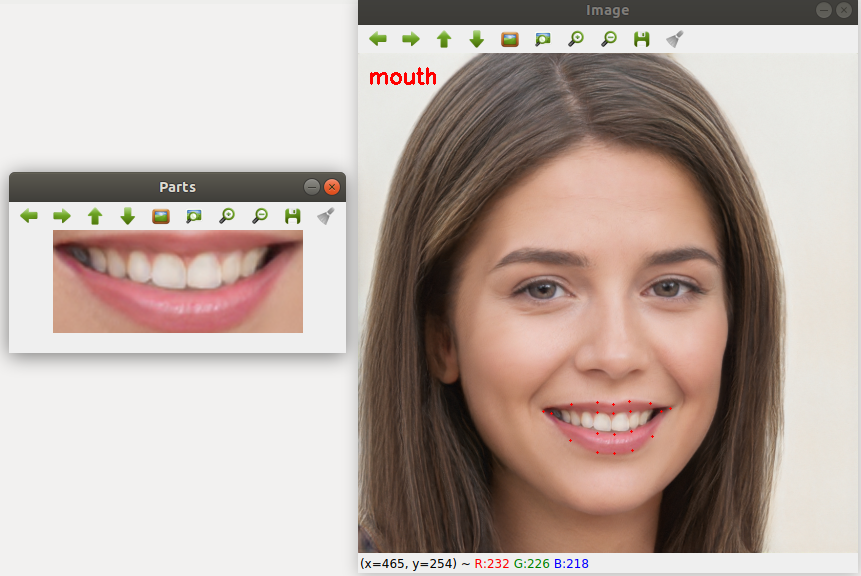
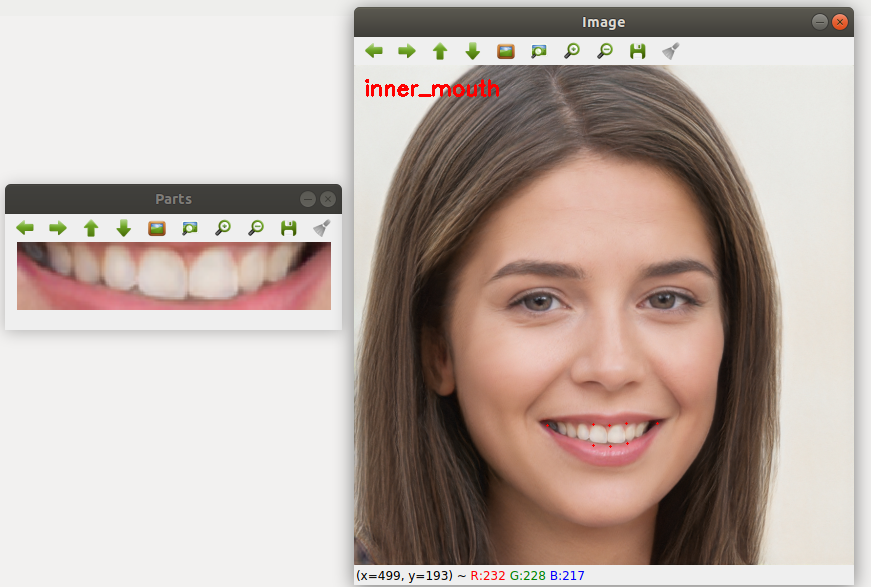
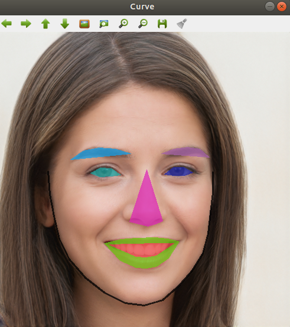

# Identify-the-landmarks-on-image-

 Detect Facial landmarks in a face.
Facial landmarks are used to localize and represent salient regions of the face, such as:
1. Mouth
2. Eyebrow
3. Eye
4. Nose
5. Jaw

In this program we try to detect the following facial landmarks using dlib, OpenCV,Python and then print and store those landmarks in a file.
1. Mouth
2. Right Eyebrow
3. Left Eyebrow
4. Right Eye
5. Left Eye
6. Nose
7. Jaw

# Understanding dlib’s facial landmark detector
The pre-trainedfacial landmark detector inside the dlib library is used to estimate the location of 68 (x, y)-coordinates that map to facial structures on the face.The indexes of the 68 coordinates can be visualized on the image below:

# Installation
Packages Required
1. imutils
2. numpy
3. argparsedlib
4. cv2

# How to run
Python program and Dlib should be in the same directory or give the path manually

Argument
python program_namepath_of_trained_model source_image_path

Example
python detect_face_parts.py --shape-predictor shape_predictor_68_face_landmarks.dat --image images/example_01.jpg

Sample Image

Sample Input Image

Output Image

Store in thelandmarks in a numpy array format.
